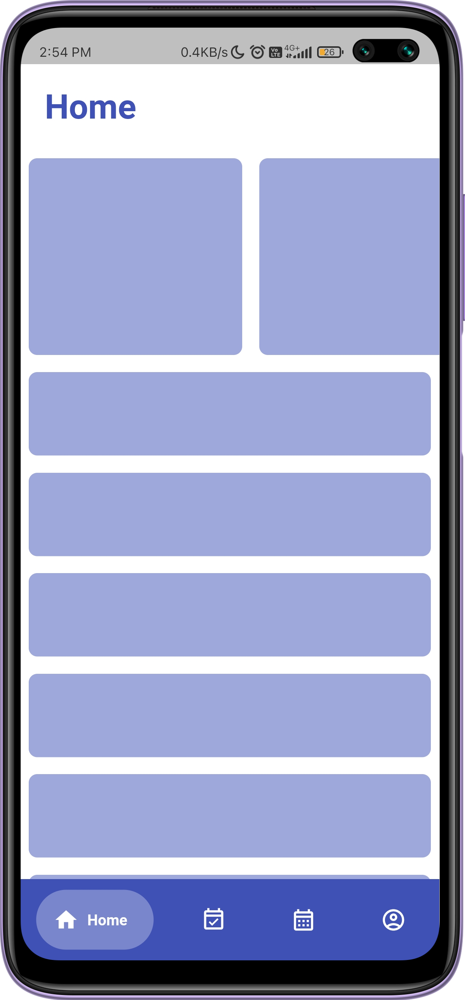

# Onlook
Hackathon Project for Cognition Hackathon
### Technologies Used:
- flutter
- firebase
### Problem Statement:
Post-pandemic with the increasing communication of official announcement and coordination of college events through platforms like whatsapp,It's increasing complexity means that there are multiple groups/channels of communication with redundant information.The issue of managing communicating on the side of the staff is also complicated.Our main objective is to address this issue.
### Proposed Solution:
It is a platform for students and teachers in a certain institution,be it a school or a college, to communicate official announcement and organize.Things like Announcements,Upcoming events,Academic calendar,class activites,club activities,exam schedules ,and changes to aforementioned matters can be accessed through a single point of contact (ie) app.
### Build instruction:
```
Requirements:
- flutter sdk
```
build and deploy instruction:
```
flutter run //to check out the software without building it
flutter build //to build the software
```
### Screenshots(prototype):

